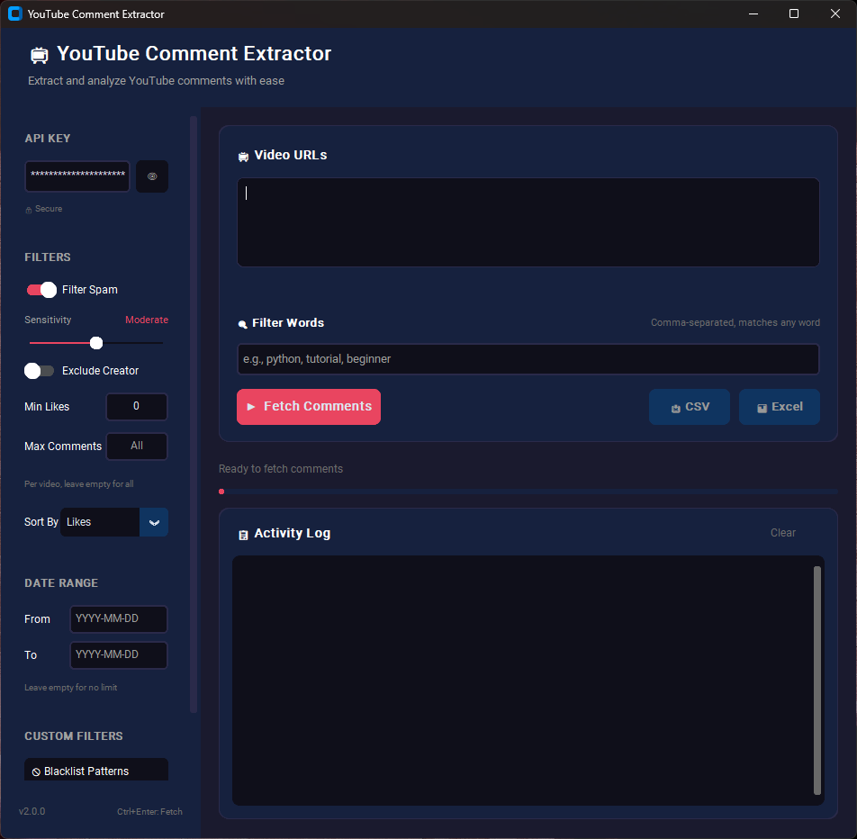

# YouTube Comment Extractor

A powerful desktop application for extracting, filtering, and analyzing YouTube comments with advanced spam detection. Built for researchers, data analysts, content creators, and anyone who needs clean, actionable comment data.




## What It Does

YouTube Comment Extractor connects to the YouTube Data API to fetch comments from any public video, then applies sophisticated filtering to separate genuine engagement from spam. The result is clean, organized data ready for analysis—exported as CSV or Excel files with full metadata.

### Why Use This Tool?

YouTube's comment section is flooded with spam. Studies show AI-generated spam now accounts for over 50% of comments on popular videos. This tool uses intent-based detection (not just keyword matching) to identify promotional spam while protecting legitimate comments—even excited fans using ALL CAPS or viewers sharing genuine testimonials.

## Features

### Core Functionality

- **Batch Processing**: Queue multiple video URLs and process them sequentially with automatic rate limiting
- **Advanced Spam Detection**: Multi-signal scoring system that catches crypto scams, self-promotion, impersonation attempts, and more
- **Filter Words**: Extract only comments containing specific keywords (great for topic-focused research)
- **Max Comments Limit**: Control how many comments to extract per video
- **Custom Filters**: Create your own blacklist and whitelist patterns for personalized spam control
- **Smart Filtering**: Filter by minimum likes, date range, or exclude creator comments
- **Dual Export**: Save to CSV (separate files) or Excel (multi-sheet workbook)
- **Secure Storage**: API keys stored in your system keyring (not plain text)

### Spam Detection Highlights

The spam filter uses intent-based detection rather than style-based filtering:

| Spam Type | Detection Method |
|-----------|------------------|
| Crypto/Financial Scams | Keyword patterns + financial promises |
| Contact Solicitation | WhatsApp, Telegram, phone numbers, emails |
| Self-Promotion | Channel plugs, "check my video" spam |
| Impersonation | Fake verification badges, suspicious usernames |
| Obfuscation Attacks | Cyrillic homoglyphs (сontact → contact), leetspeak |

**Legitimate comments are protected** through legitimacy signals:
- Timestamp references ("at 5:32") reduce spam scores
- Questions and genuine discussion are rewarded
- High engagement (likes) validates authenticity
- Long, thoughtful comments get bonus credit

> ⚠️ **Note on False Positives**: While the spam filter is designed to minimize false positives, no automated system is perfect. Some legitimate comments may occasionally be flagged as spam, especially those discussing cryptocurrency, trading, or self-promotion in a genuine context. We recommend reviewing the "Flagged Spam" export to recover any incorrectly filtered comments. You can also use the **Whitelist** feature to create patterns that protect specific types of comments.

### User Interface

- **Modern Dark Theme**: Easy on the eyes during long sessions
- **Two-Panel Layout**: Settings sidebar on the left, main content on the right
- **Sensitivity Slider**: Adjust spam filter aggressiveness (Light → Moderate → Aggressive)
- **Secure Indicator**: Shows when API key is stored securely in system keyring
- **Real-time Progress**: Activity log shows exactly what's happening
- **Live URL Validation**: Instant feedback on pasted URLs
- **Keyboard Shortcuts**: `Ctrl+Enter` to fetch, `Ctrl+S` for CSV, `Ctrl+E` for Excel

## Installation

### Prerequisites

- Python 3.9 or higher
- A YouTube Data API v3 key ([Get one here](https://console.cloud.google.com/))

### Quick Start

```bash
# Clone the repository
git clone https://github.com/vijaykumarpeta/yt-comments-extractor.git
cd yt-comments-extractor

# Create virtual environment (recommended)
python -m venv venv
source venv/bin/activate  # Windows: venv\Scripts\activate

# Install dependencies
pip install -r requirements.txt

# Run the application
python main.py
```

### Optional: Secure API Key Storage

For secure credential storage using your system keyring:

```bash
pip install keyring
```

Without keyring, your API key is stored in `settings.json`. With keyring, it's stored securely in your operating system's credential manager.

## Usage

### Getting Your API Key

1. Go to the [Google Cloud Console](https://console.cloud.google.com/)
2. Create a new project (or select existing)
3. Enable the **YouTube Data API v3**
4. Go to Credentials → Create Credentials → API Key
5. Copy your API key

### Basic Workflow

1. **Launch the app**: `python main.py`
2. **Enter your API key** in the sidebar
3. **Paste video URLs** (one per line) — supports multiple formats:
   - `youtube.com/watch?v=VIDEO_ID`
   - `youtu.be/VIDEO_ID`
   - `youtube.com/shorts/VIDEO_ID`
   - `youtube.com/embed/VIDEO_ID`
4. **Configure filters** as needed (sidebar)
5. **Optionally add filter words** to extract only relevant comments
6. **Click "Fetch Comments"** or press `Ctrl+Enter`
7. **Export results** to CSV or Excel

### Filter Options

| Filter | Description |
|--------|-------------|
| **Filter Spam** | Enable/disable spam detection |
| **Sensitivity** | Adjust spam filter aggressiveness (Light, Moderate, Aggressive) |
| **Exclude Creator** | Remove the video creator's own comments |
| **Min Likes** | Only include comments with N+ likes |
| **Max Comments** | Limit comments per video (leave empty for all) |
| **Sort By** | Likes, Date (Newest), or Date (Oldest) |
| **Date Range** | Filter comments by date (YYYY-MM-DD) |
| **Filter Words** | Comma-separated keywords — only include comments containing these words |
| **Blacklist Patterns** | Custom patterns to always flag as spam |
| **Whitelist Patterns** | Custom patterns to always allow through |

#### Sensitivity Levels

| Level | Threshold | Description |
|-------|-----------|-------------|
| **Light** | 0.65 | Only catches obvious spam, minimal false positives |
| **Moderate** | 0.50 | Balanced filtering (default) |
| **Aggressive** | 0.35 | Catches more spam, slight risk of false positives |

### Filter Words Feature

The **Filter Words** feature lets you extract only comments containing specific keywords. This is perfect for:

- **Topic research**: Find comments about "pricing", "tutorial", "beginner"
- **Feedback analysis**: Extract comments mentioning "bug", "feature", "suggestion"
- **Sentiment tracking**: Search for "love", "hate", "amazing", "terrible"

**How it works:**
- Enter comma-separated words: `python, tutorial, beginner`
- Uses **whole-word matching** (won't match "pythonic" when searching for "python")
- **Case-insensitive** ("Python" matches "python")
- **OR logic** — comment is included if it contains ANY of the words

### Custom Blacklist/Whitelist

Click the **Blacklist Patterns** or **Whitelist Patterns** buttons to add your own patterns:

```
# Blacklist examples (one per line):
competitor-brand
buy my course
discount code

# Whitelist examples (one per line):
official announcement
verified purchase
```

Patterns are matched case-insensitively against comment text.

## Export Formats

### CSV Export

Creates three separate files:
- `filename_metadata.csv`: Video details (title, views, likes, comment count)
- `filename_comments.csv`: All filtered comments with author, date, likes
- `filename_spam.csv`: Flagged spam with detection reasoning

### Excel Export

Creates one workbook with three sheets:
- **Metadata**: Video information
- **Comments**: Filtered comments
- **Flagged Spam**: Spam details with scores and categories

All exports use UTF-8 with BOM for Excel compatibility.

## Keyboard Shortcuts

| Shortcut | Action |
|----------|--------|
| `Ctrl+Enter` | Start fetching comments |
| `Ctrl+S` | Export to CSV |
| `Ctrl+E` | Export to Excel |

## Project Structure

```
yt-comments-extractor/
├── main.py              # GUI application (CustomTkinter)
├── extractor.py         # YouTube API wrapper
├── spam_filter.py       # Multi-signal spam detection engine
├── core/
│   ├── __init__.py      # Package exports
│   ├── constants.py     # App configuration and constants
│   ├── settings.py      # Settings management with keyring
│   └── validators.py    # Input validation utilities
├── requirements.txt     # Python dependencies
├── pyproject.toml       # Project metadata and build config
├── LICENSE              # MIT License
└── README.md            # This file
```

## Building a Standalone Executable

Create a portable `.exe` that runs without Python installed:

```bash
# Install PyInstaller
pip install pyinstaller

# Build the executable
pyinstaller --noconfirm --onefile --windowed \
    --name "YouTubeCommentExtractor" \
    --collect-all customtkinter \
    main.py
```

The executable will be created in the `dist/` folder.

## Technical Details

### API Usage

Each video fetch uses approximately:
- 1 unit for video metadata
- 1 unit per 100 comments

YouTube's default quota is 10,000 units/day. The app includes automatic rate limiting (2-5 second delays between videos) to stay within limits.

### Spam Detection Architecture

The spam filter uses a multi-signal scoring system:

1. **Normalization**: Defeats obfuscation (Cyrillic homoglyphs, leetspeak, zero-width characters)
2. **Signal Detection**: Checks 13 spam categories with weighted scores
3. **Legitimacy Bonuses**: Reduces scores for genuine engagement markers
4. **Threshold Classification**: Final score compared against configurable threshold

Default threshold: 0.5 (balanced). Lower = stricter, higher = more permissive.

### Thread Safety

All YouTube API calls run in background threads. UI updates use Tkinter's `after()` method for thread-safe communication. Cancellation is handled via `threading.Event()`.

## Troubleshooting

### "API quota exceeded"

YouTube limits API usage to 10,000 units per day. Wait 24 hours for quota reset, or create a new API key in a different project.

### "Comments are disabled"

The video owner has disabled comments. The app handles this gracefully and moves to the next video.

### "Invalid YouTube URL"

Make sure your URL matches one of the supported formats. The app validates URLs in real-time and shows a status indicator.

### "Failed to save API key to keyring"

If keyring storage fails, the app falls back to file storage. To fix keyring issues:
- **Linux**: Install `libsecret-1-dev` and `gnome-keyring`
- **macOS**: Keychain should work automatically
- **Windows**: Credential Manager should work automatically

## Contributing

Contributions are welcome! Please feel free to submit a Pull Request.

## License

This project is open source and available under the [MIT License](LICENSE).

## Acknowledgments

- Built with [CustomTkinter](https://github.com/TomSchimansky/CustomTkinter) for the modern UI
- Uses [Google API Python Client](https://github.com/googleapis/google-api-python-client) for YouTube integration
- Spam detection research informed by academic papers on YouTube comment classification

---

**Questions or issues?** [Open an issue](https://github.com/vijaykumarpeta/yt-comments-extractor/issues) on GitHub.
